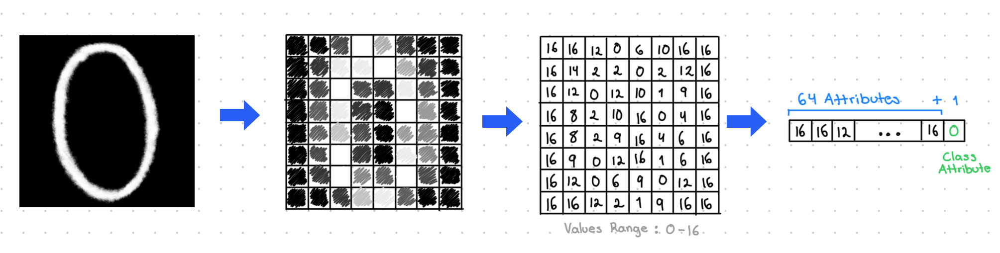
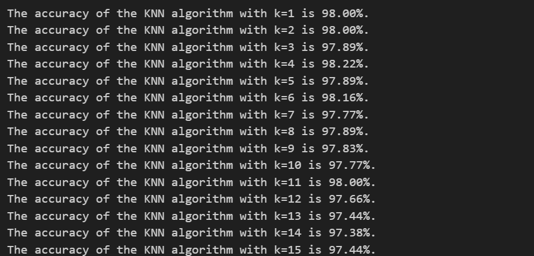

# KNN_Optdigits

## Introduction 📚

The presented project is based on the "Optical Recognition of Handwritten Digits" database, developed through the joint effort of E. Alpaydin and C. Kaynak from the Department of Computer Engineering at Bogazici University in Istanbul, Turkey, in July 1998. The essence of the problem is the automated classification of handwritten digits, a crucial research area within optical character recognition (OCR). The database was constructed using NIST preprocessing programs to extract normalized bitmaps of handwritten digits, achieving a reduced and dimensionally efficient 8x8 representation, presented in an array of 64 elements where each is an integer in the range of 0 to 16.

Fig 1. Handwritten Digit Preprocessing

To address this classification problem, is proposed the implementation of a k-nearest neighbors (k-NN) algorithm 🤖, noted for its simplicity and effectiveness in classifying complex patterns such as handwritten digits ✍️. 

## Results
The dataset was previously divided into two parts: a training set with 3823 instances 📊 and a test set with 1797 instances 📈. The prediction of the class for new digits is performed by considering the majority class among the nearest points, thus allowing classification based on similarity to previously known examples. By only changing the value of k in the model, the results were as follows:

Fig 1. Model Accuracy for each K

The results/ directory contains output files that include:
    
    - Detailed results for each test point, indicating the predicted class and whether the prediction was correct or incorrect.
    - Model accuracy metrics for different values of k.
